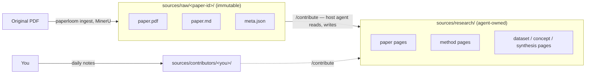

<!-- markdownlint-disable MD033 MD041 -->
# paperloom

Folder-scoped LLM-maintained research wiki. Karpathy's `llm-wiki` pattern,
for scientific papers.

<!--
Hero recording placeholder — a real 30s asciinema/GIF of the flow below
belongs here once recorded. Shown as a transcript in the meantime rather
than skipped, so the section still does its job.
-->
```console
$ mkdir my-research && cd my-research
$ paperloom init
Vault created at /home/you/my-research

$ paperloom ingest ~/Downloads/papers/
Ingesting ━━━━━━━━━━━━━━━━━━━━━━━━━━━━━━━━━━━━━━━━ 100% 12/12
12 ingested, 0 skipped, 0 failed (of 12)

$ claude "/contribute the I-JEPA paper"
[Claude Code reads sources/raw/2301.08243/paper.md, drafts a plan,
 writes sources/research/2301.08243-assran-i-jepa.md via the MCP tools]
```

## TL;DR

Paperloom is a small MCP server + CLI that gives a coding agent
(Claude Code, Gemini CLI, ...) the file primitives to maintain a personal
research wiki out of a folder of markdown files — batch PDF ingest, search,
note creation, tagging — while the agent supplies all the actual reading
and reasoning. Unlike a generic `llm-wiki` setup or MindBase's global data
folder, a paperloom vault is one self-contained directory (`git init &&
paperloom init` and you're done) built around ingesting corpora of 50-1000
papers at once, and it never requires an LLM API key of its own — your
host agent already has one.

## Credits

> Paperloom stands on two shoulders:
> - **[Andrej Karpathy](https://gist.github.com/karpathy/442a6bf555914893e9891c11519de94f)** for the LLM-wiki pattern that this whole project instantiates.
> - **[Frank Chu's MindBase](https://github.com/frankchu91/mindbase-llm-wiki)** for proving the pattern could be a product, and for the CLAUDE.md schema conventions we borrow and extend.
>
> Paperloom differs by being folder-scoped (one KB per directory, no global state), batch-ingest-first (built for corpora of 50-1000 papers), and never requiring an LLM API key of its own.

See [`docs/credits.md`](docs/credits.md) for the full story.

## Quickstart

Not yet on PyPI — install from source (see [Install](#install) below),
then:

```bash
mkdir my-vault && cd my-vault
paperloom init
paperloom ingest ~/Downloads/papers/
```

`paperloom init` doesn't create `.mcp.json` for you — add it yourself
(one-time, per vault):

```bash
cat > .mcp.json << 'EOF'
{ "mcpServers": { "paperloom": { "command": "paperloom", "args": ["mcp"] } } }
EOF
```

Then point your coding agent at the vault and start with `/contribute` or
just ask it what's in the wiki. See [`docs/quickstart.md`](docs/quickstart.md)
for the full walkthrough.

## What it is / isn't

**It is:**
- A set of file-manipulation MCP tools (`search`, `read_page`,
  `create_note`, ...) plus a CLI for batch PDF ingestion.
- Folder-scoped — every vault is a self-contained directory, no global
  state, no daemon.
- Zero-API-key by design — the host coding agent is the LLM.
- Built for real corpora — batch ingest, resumable, parallel MinerU jobs,
  per-paper failure isolation.

**It isn't:**
- A web UI. Point [Obsidian](#optional-browse-your-vault-visually) at the
  vault if you want one.
- A vector database or semantic search engine. Ripgrep + agent reasoning
  covers real usage up to hundreds of papers; see the build spec's
  non-goals if you're curious why this is deliberate.
- Its own LLM router. The Ollama plugin (v0.2) is the only "paperloom
  calls an LLM directly" path, and it's opt-in, for headless jobs only.
- Multi-user, auth'd, or a SaaS. `paperloom mcp` is stdio-only, one process
  per client.

## Install

**Not yet published to PyPI.** Clone (or copy) this repo, then install with
**[uv](https://docs.astral.sh/uv/getting-started/installation/)**, not
plain `pip` — verified directly: a fresh `pip install .` genuinely fails
with a `resolution-too-deep` error (pip's resolver can't handle the
combined dependency graph of `mineru[core]` + `fastmcp` together), while
`uv pip install .` resolves the exact same graph cleanly in a few minutes.

```bash
git clone https://github.com/Alpsource/paperloom
cd paperloom

curl -LsSf https://astral.sh/uv/install.sh | sh   # if you don't have uv yet
uv venv
uv pip install .
source .venv/bin/activate
```

(`uv pip install -e .` instead of `.` if you want to hack on paperloom
itself — see [`CONTRIBUTING.md`](CONTRIBUTING.md).)

You also need **[ripgrep](https://github.com/BurntSushi/ripgrep#installation)**
on `PATH` — it's a system binary, not a pip package:

```bash
# Debian/Ubuntu
sudo apt install ripgrep
# macOS
brew install ripgrep
# Fedora
sudo dnf install ripgrep
```

Optional extras:

```bash
uv pip install "paperloom[ollama]"   # offline synthesis via a local Ollama model
uv pip install "paperloom[grobid]"   # bibliography extraction via GROBID
uv pip install "paperloom[dev]"      # pytest, ruff, mypy, pre-commit, mkdocs-material, pip-audit
```

`mineru[core]` (the actual local PDF parser, pulled in automatically as a
core dependency) is heavy — it installs PyTorch, and downloads several GB
of model weights the first time it actually parses a PDF. There's no way
around this if you want local PDF parsing; budget the disk space and time
(and, ideally, a GPU — CPU-only parsing works but is much slower) for that
first real `paperloom ingest` run.

Tested primarily on Linux; Windows works via WSL2 (see the build spec's
own notes) but isn't the primary target.

## First vault (5 minutes)

```bash
mkdir my-research && cd my-research
paperloom init
```

This copies the `scientific-paper-vault` template in: `CLAUDE.md` (the
schema — see below), empty `context.md`/`index.md`, and the
`sources/`/`artifacts/`/`logs/` skeleton. It also writes
`.paperloom/config.yaml` and runs `git init` if you haven't already.

```bash
paperloom ingest ~/Downloads/some-papers/
```

Every PDF gets parsed by MinerU into `sources/raw/<paper-id>/paper.md` +
`meta.json`. IDs are detected from the arXiv/DOI pattern on the first page
when possible, falling back to a content hash. This step never touches
`sources/research/` — ingestion and wiki-writing are deliberately separate.

```bash
claude "/contribute sources/raw/2301.08243"
```

Your coding agent reads `CLAUDE.md`, drafts a plan (which pages to create,
which to update), shows it to you, and on approval writes real wiki pages
via the MCP tools. Repeat for more papers, then try:

```bash
claude "What does my wiki know about JEPA?"
```

See [`examples/ml-robotics-vault/`](examples/ml-robotics-vault/) for a
fully populated example vault you can browse instead of building one from
scratch.

## Architecture



Three layers, three trust levels: `sources/raw/` is a faithful,
never-edited transcription; `sources/research/` is where the agent's
actual judgment lives, always citing back to `raw/`; `sources/contributors/`
is your own daily log, appended to but never rewritten. See
[`docs/schema.md`](docs/schema.md) for the full page-shape reference.

## The 10 tools

| Tool | Does |
|---|---|
| `search` | Full-text search across the vault (ripgrep-backed). Returns paths + snippet + line + score, optionally scoped by `path_prefix`. |
| `read_page` | Read a markdown file's full contents, including frontmatter. |
| `list_pages` | List files under a subdir with basic frontmatter (type, tags, title) — fast, no full-body reads. |
| `create_note` | Create a new markdown file with YAML frontmatter. Fails if the path exists; refuses to write outside `sources/`, `artifacts/`, or `logs/`. |
| `append_to_page` | Append content to an existing page, optionally under a named section. `guard` controls what happens if the page is marked `human_edited: true`. |
| `tag_note` | Merge or replace a page's frontmatter tags. |
| `log_entry` | Append a timestamped line to today's log, or a contributor's daily file. |
| `ingest_pdf` | Ingest a single PDF from inside an agent session — the same pipeline as `paperloom ingest`, supervised subprocess included. |
| `vault_info` | Root, config, and file counts for the current vault — a good first call each session. |
| `describe_workflow` | Return a step-by-step recipe for `/contribute`, `/ask`, `/lint`, or `/rebuild-context` — the one accommodation for weaker local models (see [Local / offline models](#local--offline-models)); frontier models don't usually need it. |

That's the whole list, on purpose — see the build spec for what's
deliberately *not* a core tool (semantic search, auto-linting fixups,
multi-user anything) and why.

## Plugins

Need a tool beyond the 9? Write a plugin — a Python module exposing
`register(mcp)`, loaded from three places (built-in, third-party via pip
entry points, or vault-local in `.paperloom/plugins/`) with the later ones
overriding the earlier on a name collision. See
[`docs/plugins.md`](docs/plugins.md) for the full guide and the reference
`example_plugin.py` (`word_count`, `find_orphans`).

## Local / offline models

Paperloom never calls an LLM itself — not Claude, not GPT, not a local
Ollama model, not anything. The MCP server is 10 file-operation tools;
the LLM always lives in your host agent. Want a fully offline, free setup?
Point [Continue.dev](https://continue.dev), [Cline](https://cline.bot), or
[Aider](https://aider.chat) at a local Ollama model instead of Claude Code
— same `.mcp.json`, same paperloom, zero code changes on paperloom's side.

The one accommodation paperloom's schema makes for weaker local models:
`describe_workflow(operation=...)`, a tool that returns an explicit
step-by-step recipe for any of the four operations, plus a `mode: local`
variant of every workflow baked directly into `CLAUDE.md` (fewer hops,
smaller reads, confirmation before every write). Switching a vault to
local mode is a one-line edit in its `CLAUDE.md`.

See [`docs/quickstart-local.md`](docs/quickstart-local.md) for the full
host-agent comparison and an honest breakdown of what to expect at each
model-quality tier — we're not going to promise a 3B model synthesizes
like Sonnet does, and neither should you.

## Migrating from MindBase

```bash
paperloom migrate-from-mindbase ~/mindbase-data/projects/my-research/
```

Copies (never moves) `sources/raw/`, `sources/research/`,
`sources/contributors/`, `context.md`, `README.md`, and `logs/` into a new
paperloom vault, re-deriving indices from disk rather than trusting
MindBase's `index.yaml`. *(v0.2 — not yet built; tracked as §17 item 9 in
the build spec.)*

## Optional: browse your vault visually

Paperloom vaults are plain markdown with `[[wikilinks]]`, so
[Obsidian](https://obsidian.md/) works on one out of the box:

1. Open Obsidian → "Open folder as vault" → your paperloom vault root.
2. Optionally install the Dataview plugin — the YAML frontmatter is
   Dataview-queryable.
3. `Ctrl-G` for the graph view.

Not required, not depended on — just a happy accident of the file format.

## Roadmap

Planned plugins (v0.3+, community-contributable), not core-tool additions:

- `arxiv_watcher` — poll arXiv for new papers matching saved queries.
- `marp_export` — turn a synthesis page into a Marp slide deck.
- `graph_export` — export the `[[wikilink]]` graph as GraphViz/JSON.
- `citekey_lint` — validate `\cite{...}` references in draft artifacts.

Core (the 10 tools, the CLI, the plugin system, the schema) is considered
done as of v0.1 — see [`CHANGELOG.md`](CHANGELOG.md).

## Contributing

See [`CONTRIBUTING.md`](CONTRIBUTING.md) — setup, test commands, and what's
pinned by the build spec vs. open for change. Issues and PRs welcome,
especially plugins.

## License

[Apache-2.0](LICENSE).

## Citation

```bibtex
@software{paperloom,
  title  = {Paperloom: a folder-scoped, LLM-maintained research wiki},
  author = {{paperloom contributors}},
  year   = {2026},
  url    = {https://github.com/Alpsource/paperloom}
}
```
