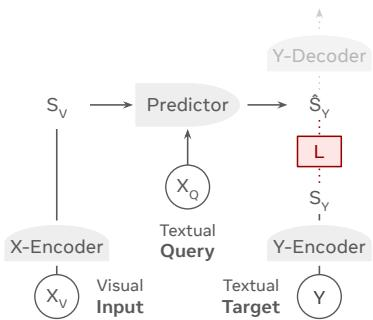
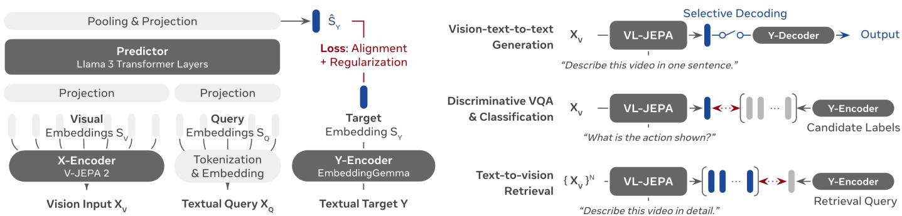
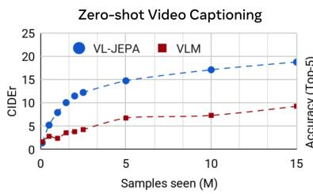
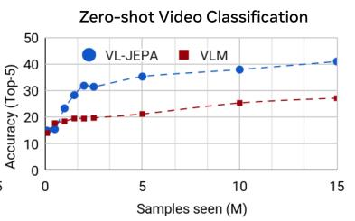
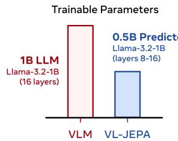
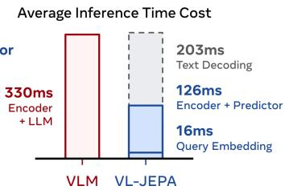
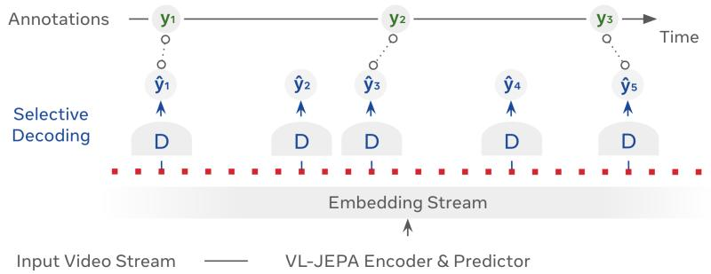
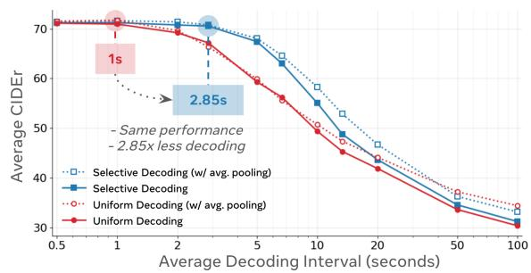

# VL-JEPA: Joint Embedding Predictive Architecture for Vision-language

Delong Chen1,2\*, Mustafa Shukor1,3\*, Théo Moutakanni1\*, Willy Chung1,3\*, Jade Yu1, Tejaswi Kasarla1, Yejin Bang1, Allen Bolourchi1, Yann LeCun1,4, Pascale Fung1,2

1 Meta FAIR 2 HKUST 3 Sorbonne Université 4 NYU

\* Equal contribution delong.chen@connect.ust.hk

We introduce VL-JEPA, a vision-language model built on a Joint Embedding Predictive Architecture (JEPA). Instead of autoregressively generating tokens as in classical VLMs, VL-JEPA predicts continuous embeddings of the target texts. By learning in an abstract representation space, the model focuses on task-relevant semantics while abstracting away surface-level linguistic variability. In a strictly controlled comparison against standard token-space VLM training with the same vision encoder and training data, VL-JEPA achieves stronger performance while having 50% fewer trainable parameters. At inference time, a lightweight text decoder is invoked only when needed to translate VL-JEPA predicted embeddings into text. We show that VL-JEPA natively supports selective decoding that reduces the number of decoding operations by ∼2.85× while maintaining similar performance compared to non-adaptive uniform decoding. Beyond generation, the VL-JEPA’s embedding space naturally supports open-vocabulary classification, text-to-video retrieval, and discriminative VQA without any architecture modification. On eight video classification and eight video retrieval datasets, the average performance VL-JEPA surpasses that of CLIP, SigLIP2, and Perception Encoder. At the same time, the model achieves comparable erformance as classical VLMs (InstructBLIP, QwenVL) on four VQA datasets: GQA, Tall QA, POPE and POPEv2, despite only having 1.6B parameters.

## 1 Introduction

One of the most important aspects of advanced machine intelligence is the ability to understand the physical world that surrounds us. This ability enables AI systems to learn, reason, plan and act in the real world in order to assist humans [LeCun, 2022]. Intelligent systems that need to act in the real world includes wearable devices and robots [Fung et al., 2025]. Machine learning tasks that make up for this ability include captioning, retrieval, visual question answering, action tracking, reasoning and planning etc [Bordes et al., 2024, Chen et al., 2025b]. Systems for such real-world applications must have real-time response with low latency and inference cost.

Currently, the common approach to achieve these tasks is to use large token-generative Vision Language Models (VLMs) [Liu et al., 2023, Dai et al., 2023, Alayrac et al., 2022, Chen et al., 2024b, Cho et al., 2025, Chen et al., 2022], which takes visual input $X _ { V } ,$ textual query 𝑋𝑄 to generate desired textual response 𝑌 autoregressively in token space, i.e., $( X _ { V } , X _ { Q } ) \mapsto Y$ . This is straightforward but inadequate for two main reasons. First, VLMs are expensive to de- velop, because they are trained to generate responses 𝑌 to queries by capturing both task-relevant semantics with task-irrelevant surface linguistic features such as words choice, style or paraphrasing. During training, VLMs must model both aspects, which results in unnecessary computing efort spent producing diverse token sequences that ultimately do not impact the correctness of the output. Second, real-time tasks involving live streaming video (e.g., live action tracking) require sparse and selective decoding (e.g.,, emitting a description only when a new event occurs) [Zhou et al., 2024]. However, VLMs rely on autoregressive token-by-token decoding, which must be completed be- fore revealing the underlying semantics of 𝑌. This process introduces unnecessary latency and hampers the ability to update semantics dynamically in real time.

  
Figure 1. VL-JEPA model architecture

This paper introduces the Joint Embedding Predictive Architecture for Vision-Language (VL-JEPA), turning ex-pensive learning of data-space token generation into more eficient latent-space semantic prediction. As illustrated in Fig. 1, the model employs x-encoder to map vision inputs $X _ { V }$ into embedding $S _ { V } ,$ a y-encoder to map the textual target 𝑌 into an embedding $S _ { Y , }$ , and a predictor that learns the mapping $( S _ { V } , X _ { Q } ) \mapsto S _ { Y }$ where $X _ { Q }$ is a textual query $( i . e .$ , the prompt). The training objective is defined in the embedding space $\mathcal { L } _ { \mathtt { V L - 1 E P A } } = D ( \hat { S } _ { Y } , S _ { Y } )$ instead of the data space $\mathcal { L } _ { \mathtt { V L M } } = D ( \hat { Y } , Y )$ . During inference, a y-decoder reads out the predicted embedding $\hat { S } _ { Y }$ to text space $\hat { Y }$ when needed.

Thanks to its non-generative nature, VL-JEPA is not forced to reconstruct every surface detail of 𝑌 in the token space. Instead, it only needs to predict the abstract repre- sentation $S _ { Y }$ in the embedding space. In the raw one-hot token space, diferent plausible 𝑌 outputs for the same input often appear nearly orthogonal if they don’t share overlapping tokens. However, in the embedding space, these diverse targets can be mapped to nearby points that share similar semantics. This simplifies the target distri- bution thus makes the learning process more eficient. In addition, unlike VLMs, this approach eliminates the need for learning language generation with a heavy decoder during training, resulting in significant eficiency gains.

Thanks to its non-autoregressive nature, VL-JEPA can produce continuous streams of target semantic embed- dings within sliding windows with minimal latency as it only require a single forward pass without autoregressive decoding. This is particularly advantageous for real-time online applications such as live action tracking, scene recognition, or planning, where the embedding stream can be selectively decoded by a lightweight y-decoder, enabling eficient and prompt updates.

In this work, we empirically validate the advantages of VL-JEPA. We conduct a strictly controlled comparison against classical token-generative VLM [Liu et al., 2023, Cho et $\mathsf { a l . } ,$ 2025]: both setups use the same vision encoder, spatial resolution, frame rate, training data, batch size, and number of iterations, etc., with the only diference being the objective in token space or embedding space. Under this matched training condition, VL-JEPA delivers consistently higher performance on zero-shot captioning and classification while using roughly half the trainable parameters, indicating that embedding-space supervision improves learning eficiency.

Beyond the training phase, VL-JEPA also delivers sub-stantial inference-time eficiency improvement through selective decoding, where decoding happens only due to significant change in the predicted embedding stream. Empirically, this strategy reduces the number of decod- ing operations by ∼2.85× while preserving overall output quality measured by average CIDEr scores.

Our final VL-JEPA models are trained in two stages: 1) a pretraining stage using caption data to establish robust vision-language alignment, and 2) a supervised finetuning (SFT) stage that equips the model with VQA capabilities. The model resulting from the first stage, denoted as $\mathbf { V L - J E P A _ { B A S E } }$ , is evaluated on zero-shot classification and text-to-video retrieval. $\mathrm { V L - J E P A _ { B A S E } }$ outperforms CLIP [Radford et al., 2021], SigLIP2 [Tschannen et al., 2025], and Perception Encoder [Bolya et al., 2025] models in terms of average classification accuracy (across 8 datasets) and retrieval recall@1 (across 8 datasets). Following the second stage, the resulting VL-JEPASFT demonstrates significantly improved classification performance due to its exposure to in-domain training data. As a unified generalist model, $\mathrm { \Delta V L - J E P A _ { S F T } }$ approaches the performance of specialist mod-els optimized for individual benchmarks. Simultaneously, $\mathrm { \Delta V L - J E P A _ { S F T } }$ exhibits efective VQA capabilities, achieving performance on par with established VLM families, such as InstructBLIP [Dai et al., 2023] and Qwen-VL [Bai et al., 2023], across four datasets covering compositional visual reasoning [Hudson and Manning, 2019], complex object counting [Acharya et al., 2019], and object hallucination [Li et al., 2023b, 2025b].

In summary, the contributions of this paper are as follows:

• We introduce VL-JEPA, the first non-generative model that can perform general-domain vision-language tasks in real-time, built on a joint embedding predictive architecture.

• We demonstrate in controlled experiments that VL- JEPA, trained with latent space embedding prediction, outperforms VLMs that rely on data space token prediction.

• We show that VL-JEPA delivers significant eficiency gains over VLMs for online video streaming appli- cations, thanks to its non-autoregressive design and native support for selective decoding.

• We highlight that our $\mathrm { \Delta V L - J E P A _ { S F T } }$ model, with an unified model architecture, can efectively handle a wide range of classification, retrieval, and VQA tasks at the same time.

## 2 Methodology

We propose VL-JEPA (Fig. 1), a model with the joint embedding predictive architecture (JEPA) for vision-language tasks. VL-JEPA is trained with triplets $\langle X _ { V } , X _ { Q } , Y \rangle$ , where $X _ { V }$ denotes the visual input (a single image or a sequence of video frames), $X _ { Q }$ is a textual query (i.e., a question) and 𝑌 is the textual target (i.e., the answer) to be predicted. The VL-JEPA comprises of four components:

Sec 1: Intro | Sec 2: Method | Sec 3: Implementation | Sec 4: Experiments | Sec 5: Related Works | Sec 6: Conclusion  
  
Figure 2. Left: VL-JEPA Architecture. It learns to predict the target embedding $S _ { Y } ,$ instead of reconstructing the raw target 𝑌 in token space as in classical VLMs. Right: VL-JEPA Applications: It handles vision-text-to-text generation tasks (e.g., captioning) with selective decoding mechanism natively supported. Furthermore, VL-JEPA’s embedding space facilitates discriminative $\mathrm { { V Q A , } }$ open-vocabulary classification and text-to-video retrieval tasks using a single unified model architecture.

1. X-Encoder $( X _ { V } \mapsto S _ { V } )$ compresses high-volume visual inputs to compact visual embeddings–a se- quence of continuous vectors analogous to “visual tokens” in classical VLMs.

2. Predictor $( \langle S _ { V } , X _ { Q } \rangle \mapsto \hat { S } _ { Y } )$ is the core component of VL-JEPA. It maps visual embeddings to a prediction of target embedding, with a textual query as conditioning.

3. Y-Encoder $( Y \mapsto S _ { Y } )$ embeds the textual target into a continuous latent space as the prediction target. The target embedding is expected to abstract away task irrelevant information.

4. Y-Decoder $( \hat { S } _ { Y } \mapsto \hat { Y } )$ is not involved during the main training phrase of VL-JEPA. At inference time, it translates the predicted embedding as human- readable text when necessary.

Fig. 2 illustrates how we instantiate the VL-JEPA architecture in this paper. For the X-Encoder, we chose V-JEPA 2 [Assran et al., 2025], a Vision Transformer that outputs a sequence of visual tokens, which are then pro- jected and fed into the Predictor initialized using Llama 3 Transformer layers. Query conditioning is achieved by tokenizing and embedding the textual query and feeding the resulting textual token embeddings into the Predictor along with the visual embeddings. The outputs of the Llama 3 Transformer layers are pooled and projected into the target embedding space produced by the Y-Encoder, which is initialized by EmbeddingGemma-300M [Vera et al., 2025]. We provide more technical details in §3.

Training Objective. JEPA models typically optimize two objectives jointly: 1) prediction error in the embed- ding space, and 2) additional regularization that avoids representation collapse [Bardes et al., 2021, Balestriero and LeCun, 2025]. Any loss that implements these two properties can be applied to VL-JEPA. Alternatively, the regularization term can be replaced by other anti-collapse strategies, such as using an exponential moving average (EMA) for the Y-Encoder [Assran et al., 2025] or freezing the Y-Encoder [Zhou et al., 2025].

In this work, we adopt the InfoNCE loss [Radford et al., 2021] due to its maturity in the vision-language domain. More advanced non-sample-contrastive regular- ization, such as VICReg [Bardes et al., 2021] and SIGReg [Balestriero and LeCun, 2025] can also be applied but we leave the exploration to future works. InfoNCE loss can be mathematically divided [Wang and Isola, 2020] into: 1) a representation alignment term that minimizes the distance between normalized prediction and target embeddings, and 2) a uniformity regularization term that pushes embeddings in a batch apart from each other, thus avoiding representation collapse. We train the Predictor and the Y-Encoder jointly with bi-directional InfoNCE loss, enabling them to mutually learn from each other.

Compared to the token-space loss used by generative VLMs, calculating the training loss in the embedding space is beneficial due to the simplified target distribu- tion. Specifically, many real-world prediction tasks are inherently ill-posed: for the same input 𝑋, there may exist multiple plausible targets 𝑌 that are all acceptable. For example, given the query “What will happen here if I flip this light switch down?”, both “the lamp is turned $o f ^ { \prime \prime }$ and “room will go dark” are valid answers. In the raw one-hot token space, however, the two sequences are orthogonal since they share no overlapping tokens. But when VL- JEPA’s Y-Encoder embeds them into nearby points (ideally yielding a compact unimodal distribution), the learning task becomes much easier: the model no longer needs to fit multiple disjoint high-density regions in sparse token space, but only a single coherent mode in a continuous embedding space.

Multi-tasking. VL-JEPA supports diverse tasks using a single, unified architecture (Fig. 2). For vision-text-to-text generation tasks, such as captioning or open-ended VQA, the query $X _ { Q }$ is a captioning prompt or a question, and the predictor learns to predict the embedding of the target output, $\hat { S } _ { Y }$ , which is then decoded into text. VL-JEPA also supports CLIP-style open-vocabulary classification and discriminative VQA, where candidate label texts are encoded into embeddings and compared with prediction $\hat { S } _ { Y }$ to select the nearest match. For text-to-video retrieval, candidate videos are mapped to their predicted embed- dings $\hat { S } _ { Y }$ using a retrieval a captioning prompt, and then ranked by similarity to the encoded textual retrieval query.

Selective Decoding. Real-world video applications often require online streaming inference, such as tracking user actions in smart glasses for procedural assistance [Chen et al., 2024c], monitoring world states for online planning, navigation and robotics [Shukor et al., 2025, Black et al., 2025, Song et al., 2025]. A central challenge is balancing two competing needs: the model must con- tinuously update semantics as new frames arrive, but computational eficiency and latency are critical.

Existing VLMs typically rely on explicit memory mech- anisms [Zhou et al., 2024, Qian et al., 2024] to decide when to decode or complex KV-cache optimizations [Di et al., 2025] for eficiency, since autoregressive language models are expensive to run continuously. VL-JEPA, in contrast, natively supports selective decoding. Since it predicts a semantic answer embedding non-autoregressively, the model provides a continuous semantic stream of $\hat { S } _ { Y }$ that can be monitored in real time. This stream can be stabilized with simple smoothing (e.g., average pooling) and decoded only when a significant semantic shift is detected, such as when the local window variance exceeds a threshold. In this way, VL-JEPA maintains always-on semantic monitoring while avoiding unnecessary decoding, achieving both responsiveness and eficiency.

## 3 Implementation of VL-JEPA

## 3.1 Model Architecture

X-Encoder. Unless otherwise specified, we use a frozen V-JEPA 2 ViT-L [Assran et al., 2025] with 304M param-eters, a self-supervised vision model that excels at both image and video tasks. Each video input is uniformly sampled into frames at $2 5 6 ^ { 2 }$ resolution. For image inputs, the same image is duplicated to match the input shape.

Predictor. The predictor is initialized with the last 8 Transformer layers of Llama-3.2-1B, resulting in 490M trainable parameters. The text tokenizer and token em- bedding are also from Llama-3.2-1B. We allow maximum 512 query tokens, and put [PAD] tokens for short queries. We disable the causal attention mask so that both vision and query embeddings can be jointly attended. Linear projections connect the predictor with the vision and text embeddings, and average pooling on non-[PAD] tokens is applied to obtain the predicted target embedding.

Y-Encoder. We use EmbeddingGemma-300M [Vera et al., 2025] as the initialization of the Y-Encoder. We set maximum context length of 512 to handle detailed captions. We found that setting a learning rate multiplier of ×0.05 to all text encoder parameters improves performance, since the quality of embedding prediction would be suboptimal in the beginning of training. Linear projection head is applied to both Predictor and Y-Encoder, obtaining a shared embedding space with 1,536 dimensions, where the loss is calculated.

## 3.2 Two-stage Training

Large-scale Pretraining. VL-JEPA is trained with two stages. The first query-free pretraining stage aims to establish robust vision-language alignment using massive caption data. We use Datacomp [Gadre et al., 2023] and YFCC-100M [Thomee et al., 2016] for image-text data. For video-text data, we use Action100M [Chen et al., 2026], which consists action description and video captions generated on HowTo100M videos [Chen et al., 2025b].

We first do image-only training on Datacomp and YFCC- 100M with only 1 frame per visual input, which allows us to use a large batch size of 24k. After 100k iterations, the model has seen 2B samples and achieved 61.6% ImageNet zero-shot accuracy (without prompt ensembling). Then, we continue with video pretraining with 8 frames per input for 60k iterations and 32 frames for 10k iterations in the end. The pretraining takes 4 weeks using 24 nodes with 8×NVIDIA H200 GPUs each. We adopt a constant learning rate of $5 { \times } 1 0 ^ { - 5 }$ to facilitate extended training. We refer the readers to the Action100M paper [Chen et al., 2026] for more details. We call the resulting model VL-JEPABASE and measure zero-shot classification and retrieval performance with this model.

Supervised Finetuning. The second query-conditioned supervised finetuning (SFT) stage empowers VL-JEPA VQA capabilities while maintaining the pretrained visionlanguage alignment for classification and retrieval. The training data is selected from the PLM data mixture [Cho et al., 2025], including 25M VQA samples, 2.8M captioning samples, 1.8M classification samples, and downsampled pretraining stage data to avoid catastrophic forgetting.

We train the model for 83k steps with a batch size of 3,072 (∼2.5s days with 24 nodes), with cosine learning rate annealing applied to improve convergence. Since excessive human labeled data is included in this SFT data mixture, we no longer emphasize zero-shot evaluation for the resulting $\mathbf { V L - J E P A _ { S F T } }$ from this stage. Instead, we evaluate VQA capabilities and compare it with state-ofthe-art specialist models.

Table 1. Video classification and text-to-video retrieval. Best zero-shot performance in each dataset are highlighted. Samples seen = training step × efective batch size.

<table><tr><td rowspan="2" colspan="2">Model</td><td rowspan="2"># Parameters</td><td rowspan="2"># Samples Seen</td><td rowspan="2">Zero-shot</td><td rowspan="2">Generalist Model</td><td colspan="10">Video Classification (Top-1 Accuracy)</td><td colspan="9">Text-to-video Retrieval (Recall@1)</td></tr><tr><td>Average</td><td>SSv2[Goyal et al., 2017]</td><td>EK100[Damen et al., 2022]</td><td>EgoExo4D[Grauman et al., 2024]</td><td>Kinetics-400[Kay et al., 2017]</td><td>COIN (SR)[Tang et al., 2019]</td><td>COIN (TR)[Tang et al., 2019]</td><td>CrossTask (SR)[Zhukov et al., 2019]</td><td>CrossTask (TR)[Zhukov et al., 2019]</td><td>Average</td><td>MSR-VTT[Xu et al., 2016]</td><td>ActivityNet[Caba Heilbron et al., 2015]</td><td>DiDeMo[Anne Hendricks et al., 2017]</td><td>MSVD[Chen and Dolan, 2011]</td><td>YouCook2[Zhou et al., 2018]</td><td>PVD-Bench[Bolya et al., 2025]</td><td>Dream-1k[Wang et al., 2024]</td><td>VDC-1k[Chai et al., 2024]</td><td></td></tr><tr><td rowspan="3">CLIP</td><td>RN50</td><td>75M</td><td>12.8B</td><td></td><td></td><td>21.8</td><td>2.1</td><td>1.5</td><td>2.1</td><td>41.4</td><td>8.6</td><td>39.0</td><td>10.9</td><td>68.7</td><td>28.3</td><td>28.7</td><td>17.7</td><td>24.7</td><td>29.7</td><td>5.1</td><td>27.6</td><td>47.2</td><td>46.0</td><td></td></tr><tr><td>ViT-B</td><td>124M</td><td>12.8B</td><td>✓</td><td>✓</td><td>25.4</td><td>3.1</td><td>1.3</td><td>2.8</td><td>49.5</td><td>11.2</td><td>47.3</td><td>16.2</td><td>71.5</td><td>29.3</td><td>31.0</td><td>19.5</td><td>25.7</td><td>34.0</td><td>6.1</td><td>27.0</td><td>48.5</td><td>42.9</td><td></td></tr><tr><td>ViT-L</td><td>389M</td><td>12.8B</td><td></td><td></td><td>30.7</td><td>3.8</td><td>3.7</td><td>2.6</td><td>58.3</td><td>14.7</td><td>63.5</td><td>20.8</td><td>78.5</td><td>35.3</td><td>35.9</td><td>23.4</td><td>30.7</td><td>41.9</td><td>7.9</td><td>36.7</td><td>56.8</td><td>49.3</td><td></td></tr><tr><td rowspan="3">SigLIP2</td><td>ViT-B</td><td>375M</td><td>40B</td><td></td><td></td><td>33.9</td><td>5.2</td><td>2.3</td><td>4.5</td><td>57.8</td><td>20.6</td><td>69.9</td><td>27.7</td><td>82.9</td><td>39.6</td><td>40.2</td><td>25.0</td><td>32.1</td><td>48.6</td><td>13.8</td><td>52.1</td><td>60.9</td><td>43.7</td><td></td></tr><tr><td>ViT-L</td><td>882M</td><td>40B</td><td>✓</td><td>✓</td><td>38.6</td><td>5.9</td><td>4.5</td><td>6.4</td><td>63.6</td><td>24.2</td><td>78.5</td><td>35.1</td><td>90.8</td><td>45.4</td><td>41.6</td><td>32.7</td><td>35.1</td><td>53.5</td><td>19.0</td><td>59.2</td><td>71.6</td><td>50.9</td><td></td></tr><tr><td>ViT-g</td><td>1.9B</td><td>40B</td><td></td><td></td><td>39.8</td><td>6.1</td><td>6.1</td><td>5.6</td><td>68.0</td><td>26.0</td><td>80.4</td><td>35.1</td><td>90.8</td><td>47.5</td><td>43.4</td><td>33.9</td><td>38.9</td><td>56.0</td><td>22.2</td><td>60.4</td><td>73.0</td><td>52.5</td><td></td></tr><tr><td rowspan="3">PE-Core</td><td>ViT-B</td><td>448M</td><td>58B</td><td></td><td></td><td>37.2</td><td>5.8</td><td>3.3</td><td>6.0</td><td>65.4</td><td>21.5</td><td>77.1</td><td>26.9</td><td>91.8</td><td>44.9</td><td>46.5</td><td>35.4</td><td>35.3</td><td>49.1</td><td>15.2</td><td>59.8</td><td>68.7</td><td>49.2</td><td></td></tr><tr><td>ViT-L</td><td>671M</td><td>58B</td><td>✓</td><td>✓</td><td>42.9</td><td>9.3</td><td>6.0</td><td>11.6</td><td>73.4</td><td>27.1</td><td>83.3</td><td>37.5</td><td>95.3</td><td>50.2</td><td>48.9</td><td>41.7</td><td>40.8</td><td>56.2</td><td>22.5</td><td>64.7</td><td>75.9</td><td>51.0</td><td></td></tr><tr><td>ViT-G</td><td>2.3B</td><td>86B</td><td></td><td></td><td>44.7</td><td>9.0</td><td>6.4</td><td>13.6</td><td>76.4</td><td>29.0</td><td>86.0</td><td>40.3</td><td>97.2</td><td>58.1</td><td>51.6</td><td>49.1</td><td>44.5</td><td>58.7</td><td>26.0</td><td>77.0</td><td>89.2</td><td>68.5</td><td></td></tr><tr><td>VL-JEPABASE</td><td>ViT-L</td><td>1.6B</td><td>3.3B</td><td>✓</td><td>✓</td><td>52.5</td><td>19.3</td><td>21.8</td><td>33.2</td><td>64.8</td><td>47.4</td><td>79.4</td><td>64.5</td><td>89.6</td><td>63.7</td><td>40.0</td><td>64.9</td><td>50.0</td><td>49.0</td><td>40.4</td><td>83.1</td><td>93.3</td><td>88.8</td><td></td></tr><tr><td>VL-JEPASFT</td><td>ViT-L</td><td>1.6B</td><td>3.6B</td><td>✘</td><td>✓</td><td>75.4</td><td>73.2</td><td>44.6</td><td>68.1</td><td>84.8</td><td>66.4</td><td>90.3</td><td>79.8</td><td>96.2</td><td>63.8</td><td>46.2</td><td>62.4</td><td>52.3</td><td>52.3</td><td>37.8</td><td>82.6</td><td>89.3</td><td>87.7</td><td></td></tr><tr><td colspan="3">Previous SoTA (including specialist models)</td><td>✘</td><td>✘</td><td>-</td><td>-</td><td>77.5</td><td>56.4</td><td>47.8</td><td>92.1</td><td>67.3</td><td>95.3</td><td>64.5</td><td>96.0</td><td>-</td><td>62.8</td><td>74.1</td><td>74.2</td><td>61.4</td><td>28.9</td><td>77.0</td><td>89.2</td><td>68.5</td><td></td></tr></table>

## 4 Experiments

We begin by evaluating VL-JEPA’s classification and retrieval performance in §4.1, and benchmark VL-JEPA on VQA datasets in §4.2. We demonstrate application of VL-JEPA for understanding the relationship between world state changes and action concepts (i.e., inverse dynamics) in §4.3. In §4.5, we demonstrate the advantage of embedding prediction by comparing it with a token-predictive VLM baseline under a strictly controlled setting. In §4.6, we evaluate the efectiveness of VL-JEPA’s selective decoding, and show that it reduces decoding cost while maintaining the performance. Next, we analyze VL-JEPA’s Y-Encoder in §4.7. Finally, we present ablation studies in §4.8.

## 4.1 Classification and Retrieval

Evaluation Setup. We evaluate VL-JEPA following the CLIP-style evaluation protocol (see Fig.2 and §2 “Multitasking”). We assess VL-JEPA on a broad suite of bench-marks, including 8 classification datasets and 8 retrieval datasets. For zero-shot evaluation, we compare against generalist foundation models CLIP [Radford et al., 2021], SigLIP2 [Tschannen et al., 2025], and Perception Encoder (PE-Core)[Bolya et al., 2025]. We additionally report reference numbers from specialist models that are individually optimized for each benchmark.

Results. Table 1 summarizes the results. In the strict zero-shot setting, VL-JEPABASE achieves higher average accuracy (52.5 vs 44.7) across the 8 classification datasets and higher average recall@1 (63.7 vs 58.1) across the 8 retrieval datasets than the best baseline PE-Core-G. Per-dataset scores show that VL-JEPABASE is particularly strong on motion-centric benchmarks (SSv2, EK-100, EgoExo4D, and step recognition on COIN and CrossTask), while relatively weaker on appearance-centric benchmarks (Kinetics-400 and task recognition on COIN and CrossTask). This is due to VL-JEPABASE has seen substantially fewer vision-language pairs (only 3.6B in comparison with PE-Core-G’s 86B). After supervised finetuning, VL-JEPASFT improves significantly upon VL-JEPABASE since the model has seen in-domain training data. As a single generalist model, the performance of VL-JEPASFT is approaching specialist models optimized individually for each dataset.

## 4.2 Visual Question Answering

Evaluation Setup. We evaluate VL-JEPASFT on discriminative VQA tasks. The inference process involves encode candidate answers using the Y-Encoder and selecting the answer that minimizes the distance to the predicted em- bedding (see Fig. 2). We select four benchmarks that prioritize visual perception rather than knowledge and reasoning. We evaluate on GQA [Hudson and Manning, 2019], a dataset for real-world visual reasoning and com-positional QA, reporting accuracy on the testdev-balanced split. For TallyQA [Acharya et al., 2019], which targets complex counting, we follow Chen et al. [2022] and report the weighted average accuracy across the “simple” and “complex” splits. Finally, to assess object hallucination, we utilize POPE [Li et al., 2023b] and POPEv2 [Li et al., 2025b]. For POPE, we report the average accuracy across the “random”, “popular”, and “adversarial” settings on MS-COCO.

Results. Table 4.2 compares VL-JEPASFT against established VLM families, including BLIP-2 [Li et al., 2023a], InstructBLIP [Dai et al., 2023], Qwen-VL [Bai et al., 2023], InternVL [Chen et al., 2024d], Llava-1.5 [Vallaeys et al., 2024], SmolVLM [Marafioti et al., 2025], PaLI [Chen et al., 2022], PaliGemma [Beyer et al., 2024], and Video-LLaVA [Lin et al., 2024]. $\mathrm { \Delta V L - J E P A _ { S F T } }$ outperforms many of these baselines despite requiring significantly less computational resources–classical VLMs rely on extensively pretrained CLIP backbones combined with multi-stage visual instruc- tion tuning. In comparison, VL-JEPASFT employs a unified architecture and a single embedding space to seamlessly handle VQA, classification, and retrieval (Tab. 1).

POPEv2: object hallucination  
TallyQA: complex object counting  
GQA: compositional visual reasoning  
Table 2. VQA benchmarks. We report accuracy on GQA [Hudson and Manning, 2019], TallyQA [Acharya et al., 2019], POPE [Li et al., 2023b], and POPEv2 [Li et al., 2025b]. Scores lower than our model are marked in red. Scores from SmolVLM are obtained by our evaluation, while other baselines are reported in the literature.

<table><tr><td>Model</td><td>Accuracy</td></tr><tr><td>BLIP-2 (OPT-2.7B)</td><td>33.9</td></tr><tr><td>BLIP-2 (FlanT5XXL)</td><td>41.0</td></tr><tr><td>InstructBLIP (FlanT5XL)</td><td>48.4</td></tr><tr><td>InstructBLIP (Vicuna-13B)</td><td>49.5</td></tr><tr><td>Qwen-VL-Chat-7B</td><td>57.5</td></tr><tr><td>Qwen-VL-7B</td><td>59.3</td></tr><tr><td>InternVL-Chat (Vicuna-7B)</td><td>59.5</td></tr><tr><td>LLaVA-1.5 (Vicuna-7B)</td><td>62.0</td></tr><tr><td>InternVL-Chat (Vicuna-13B)</td><td>66.6</td></tr><tr><td>VL-JEPASFT(1.6B)</td><td>61.5</td></tr></table>

<table><tr><td>Model</td><td>Accuracy</td></tr><tr><td>SmolVLM-256M</td><td>32.3</td></tr><tr><td>SmolVLM-500M</td><td>44.8</td></tr><tr><td>PaLI-700M</td><td>62.3</td></tr><tr><td>SmolVLM-2B</td><td>64.7</td></tr><tr><td>PaLI-3B</td><td>65.8</td></tr><tr><td>InstructBLIP (Vicuna-13B)</td><td>68.0</td></tr><tr><td>PaLI-17B</td><td>71.9</td></tr><tr><td>LLaVA-1.5 (Vicuna-13B)</td><td>72.3</td></tr><tr><td>PaliGemma (3B)</td><td>76.8</td></tr><tr><td>VL-JEPASFT(1.6B)</td><td>69.9</td></tr></table>

<table><tr><td>Model</td><td>Accuracy</td></tr><tr><td>SmolVLM2-256M</td><td>56.4</td></tr><tr><td>SmolVLM-256M</td><td>57.9</td></tr><tr><td>LLaVA-7B</td><td>72.9</td></tr><tr><td>InstructBLIP (Vicuna-13B)</td><td>79.0</td></tr><tr><td>Video-LLaVA (7B)</td><td>83.4</td></tr><tr><td>SmolVLM-500M</td><td>85.8</td></tr><tr><td>LLaVA-1.5-7B</td><td>85.9</td></tr><tr><td>LLaVA-1.5-13B-HD</td><td>86.3</td></tr><tr><td>SmolVLM-2B</td><td>87.5</td></tr><tr><td>VL-JEPASFT(1.6B)</td><td>85.7</td></tr></table>

<table><tr><td>Model</td><td>Accuracy</td></tr><tr><td>SmolVLM-256M</td><td>62.3</td></tr><tr><td>LLaVA-1.5-13B</td><td>72.7</td></tr><tr><td>InternVL2-8B</td><td>74.5</td></tr><tr><td>InternVL2-26B</td><td>76.1</td></tr><tr><td>Qwen2-VL-72B</td><td>79.4</td></tr><tr><td>SmolVLM-500M</td><td>83.8</td></tr><tr><td>Qwen2-VL-7B</td><td>87.0</td></tr><tr><td>SmolVLM-2B</td><td>88.8</td></tr><tr><td>Qwen2-VL-2B</td><td>91.3</td></tr><tr><td>VL-JEPASFT(1.6B)</td><td>86.3</td></tr></table>

Table 3. WorldPrediction-WM benchmark results. We compare the accuracy between large VLMs, socratic LLMs, and VL-JEPA. VL-JEPASFT achieves a new SoTA at 65.7%.

<table><tr><td colspan="8">Vision Language Models</td><td colspan="10">Socratic LLMs (w/ Qwen2.5-VL-72B captions)</td><td colspan="2">VL-JEPA</td></tr><tr><td></td><td colspan="3">InternVL2.5</td><td colspan="4">Qwen2.5-VL</td><td colspan="2">Llama-3.1</td><td colspan="2">Llama-4</td><td colspan="2">Qwen2.5</td><td>GPT-4o</td><td>Claude-3.5</td><td>Gemini-2</td><td>BASE</td><td>SFT</td><td></td></tr><tr><td>2B</td><td>4B</td><td>26B</td><td>38B</td><td>3B</td><td>7B</td><td>32B</td><td>72B</td><td>8B</td><td>70B</td><td>109B</td><td>400B</td><td>3B</td><td>7B</td><td>72B</td><td>N/A</td><td>N/A</td><td>N/A</td><td>1.6B</td><td>1.6B</td></tr><tr><td>20.0</td><td>29.8</td><td>30.2</td><td>50.3</td><td>21.6</td><td>45.5</td><td>49.0</td><td>57.0</td><td>48.7</td><td>49.8</td><td>52.7</td><td>53.6</td><td>44.0</td><td>49.1</td><td>48.5</td><td>52.0</td><td>53.3</td><td>55.6</td><td>63.9</td><td>65.7</td></tr></table>

## 4.3 WorldPrediction-WM

Evaluation Setup. We evaluate VL-JEPA on the “world modeling” task in the WorldPrediction [Chen et al., 2025a] benchmark, where the model is provided with two images representing the initial and final world states and must identify, among four candidate video clips, the action that explains the observed transition. To adapt VL-JEPA, we duplicate and concatenate the initial and final state images to extract a state embedding, and encode each action candidate into action embeddings. The model then selects the candidate whose embedding is closest to the state embedding.

Results. Table 3 shows accuracy comparisons. VL- $\mathrm { J E P A _ { B A S E } }$ attains 63.9% and $\mathrm { \Delta V L - J E P A _ { S F T } }$ attains 65.7% top-1 accuracy on WorldPrediction-WM, establishing a new state of the art. Our VL-JEPA model not only substantially surpasses existing VLMs of comparable or larger scale but also exceeds the performance of frontier LLMs such as GPT-4o, Claude-3.5-sonnet, and Gemini-2.0.

## 4.4 Action Anticipation

Evauation Setup. We assess the action anticipation (i.e., forecasting future actions) capabilities of fine-tuned VL-JEPA on two benchmarks: action anticipation with EPIC-

Table 4. Finetuning results on EPIC-KITCHENS-100 action anticipation (Recall@5) for diferent anticipation time 𝑡. VL-JEPA outperforms V-JEPA2 with a ViT-L-256px vision encoder across all anticipation time.

<table><tr><td>Model</td><td>Vision Encoder</td><td> $t = 1s$ </td><td> $t = 2s$ </td><td> $t = 4s$ </td><td> $t = 10s$ </td></tr><tr><td>V-JEPA2</td><td>ViT-g-384px</td><td>39.7</td><td>28.6</td><td>19.3</td><td>8.2</td></tr><tr><td>V-JEPA2</td><td>ViT-L-256px</td><td>32.7</td><td>23.4</td><td>15.9</td><td>7.1</td></tr><tr><td>VL-JEPA</td><td>ViT-L-256px</td><td>34.2</td><td>26.0</td><td>19.4</td><td>11.7</td></tr></table>

Table 5. Finetuning result on COIN next step forecasting. VL-JEPA established a new SoTA at 56.2.

<table><tr><td>Model</td><td>VideoLLM -online (8B)</td><td>VideoLLM -MoD (8B)</td><td>ProVideLLM -8B/11+</td><td>VL-JEPA (1.6B)</td></tr><tr><td>Accuracy</td><td>49.1</td><td>49.7</td><td>53.6</td><td>56.2</td></tr></table>

KITCHENS-100 [Damen et al., 2022], and COIN [Tang et al., 2019] next step forecasting. In this task, given a window of context video, the model is required to predict the next action that will occur after a specified anticipation time—the temporal gap between the end of the context segment and the onset of the subsequent action. VL- $\mathrm { J E P A } _ { \mathsf { S F T } }$ is fine-tuned and we compare our results against the state-of-the-art baselines.

Results As compated in Table VL-JEPA demonstrates strong performance in both benchmarks (Table 4 and Table 5). For the Epic-Kitchens-100, particularly at the standard 1-second anticipation interval, where it achieves a Recall@5 of 34.18 – surpassing the previous V-JEPA 2 that uses the same ViT-L-256px encoder by 1.48 points. While the larger V-JEPA 2 ViT-g-384px model attains the highest score at 1 second, VL-JEPA remains competitive and shows notable advantages at longer anticipation intervals. On the

  
Figure 3. Comparison of embedding prediction (VL-JEPA) and token prediction (VLM). We conduct a fair comparison of under strictly aligned training settings (encoder, data, batchsize, etc.). Left: Zero-shot video captioning CIDEr score averaged over 3 datasets and zero-shot classification accuracy (top-5) averaged over 3 benchmarks. Right: Comparing the trainable parameters and average inference time cost.

COIN next step forecasting task, as shown in Tab. 5, VL- JEPA achieves 56.2%, outperform strong VLM baselines VideoLLM-online [Chen et al., 2024c], VideoLLM-MoD [Wu et al., 2024], ProVideLLM [Chatterjee et al., 2025]. Overall, these findings demonstrated that VL-JEPA can be finetuned to handle semantic uncertain prediction tasks.

## 4.5 Embedding Prediction vs. Token Prediction: A Controlled Comparison

Evaluation Setup. In this section, we compare VL-JEPA to a token-generative VLM baseline under a strictly aligned training conditions. Both models use the same Perception Encoder [Bolya et al., 2025] (frozen ViT-L-14 with 3362 resolution, no tiling, 16 frames per video) for vision inputs. We use the same training iterations with the same efective batch size of 128, same learning rate scheduler on the same pretraining data mixture described above (§3). The only diference is the prediction task: VL-JEPA predicts target embeddings [Duquenne et al., 2023] using a 0.5B predictor, whereas the VLM baseline performs next-token prediction with cross-entropy using a 1B LLM. For VLM, we use the standard training recipe and codebase of PerceptionLM [Cho et al., 2025], aligning frozen vision encoder and textonly LLM Llama-3.2-1B. For VL-JEPA, we initialize the predictor from the 8-16 layers of Llama-3.2-1B.

We evaluate both models at regular checkpoints through- out training spanning from 500K to 15M samples seen. At each checkpoint, we measure the performance on video captioning and video classification. For video captioning, we report CIDEr scores averaged across YouCook2 [Zhou et al., 2018], MSR-VTT [Xu et al., 2016] and PVD-Bench [Bolya et al., 2025]. VL-JEPA decodes the predicted embeddings while VLM generates the tokens directly. For video classification, we report top-5 accuracy averaged across CrossTask-Step, CrossTask-Task [Zhukov et al., 2019] and EgoExo4D [Grauman et al., 2024]. For VL-JEPA we choose the candidate with lowest cosine distance to the predicted embedding, while for VLM we pick the class with lowest perplexity.

Results. As shown in Fig. 3, both models yield compa- rable performance after 500K samples seen in both tasks, with respectively 1.23 and 1.35 CIDEr in video captioning and 14.9% and 14.0% top-5 accuracy for VL-JEPA and VLM. After a few iterations, we show that VL-JEPA’s performance increase is much sharper compared to VLM, reaching 14.7 CIDEr and 35.3% top-5 accuracy after 5M samples seen. This gap remains constant as training scales at 15M samples with 14.8 CIDEr and 41.0% top-5 accuracy for VL-JEPA, while the VLM baseline yield respectively 7.1 CIDEr and 27.2% top-5 accuracy. This controlled com- parison highlights the benefit of predicting embeddings rather than tokens, showing both higher sample eficiency and stronger absolute performance.

We compare the inference cost of the above VL-JEPA and the VLM by pre-loading 64 video frames into memory and repeatedly decoding text 100 times with the same prompt, measuring the average time per sample. As shown in Fig. 3 (right most), both models exhibit comparable latency when generating text. What diferentiates our model from classical VLM is the decoupling between the prompt processing (“Query Embedding”) and the video encoder (“Encoder + Predictor”) from the text generation module (“Decoder”). This allows us to only use the first part of the model to perform retrieval and decode text only when needed (see Section 4.6 below), making our model more scalable for online video inference.

## 4.6 Efectiveness of Selective Decoding

Evaluation Setup. We evaluate the efectiveness of VL- JEPA’s embedding-guided selective decoding on long-form video streams. To this end, we design a benchmark task where the goal is to recover a temporal sequence of an- notations while minimizing the number of text decoding operations, which dominate inference cost. As shown in Fig. 4 (left), decoding is performed only at selected points along the VL-JEPA embedding stream, yielding a sequence of 𝑁 decoded outputs $[ ( \hat { t } _ { 1 } , \hat { y } _ { 1 } ) , ( \hat { t } _ { 2 } , \hat { y } _ { 2 } ) , \dots , ( \hat { t } _ { N } , \hat { y } _ { N } ) ]$ . Each ground-truth annotation $[ ( t _ { 1 } , y _ { 1 } ) , ( t _ { 2 } , y _ { 2 } ) , \dots , ( t _ { T } , y _ { T } ) ]$ is then aligned to its nearest decoded output in time (illustrated as ◦ · · · ◦ in Fig. 4), and CIDEr is computed between matched pairs. We use the EgoExo4D [Grauman et al., 2024] validation set in procedural activity domains, which consists of 218 videos with an average duration of 6 minutes and about $T = 1 4 3$ atomic action annotations per video.

  
Figure 4. Evaluation of selective decoding. Left: We compare uniform sampling of decoding points at fixed intervals (red) and embedding-guided selective decoding (blue). Performance is measured by the average CIDEr score between each annotation 𝑦 and its closest decoded output 𝑦ˆ. Right: Results on EgoExo4D show that selective decoding achieves a Pareto improvement over uniform sampling: for the same performance level, it requires fewer decoding operations.

Table 6. Comparison of text-encoders performance. We report triplet-based accuracy (%) on SugarCrepe++ and VISLA datasets.

<table><tr><td rowspan="2" colspan="2">Model</td><td rowspan="2"># Params.(total)</td><td rowspan="2"># Params.(text encoder)</td><td colspan="6">SugarCrepe++ [Dumpala et al., 2024a]</td><td colspan="3">VISLA [Dumpala et al., 2024b]</td></tr><tr><td>Average</td><td>ReplaceAttribute</td><td>ReplaceObject</td><td>ReplaceRelation</td><td>SwapAttribute</td><td>SwapObject</td><td>Average</td><td>Generic</td><td>Spatial</td></tr><tr><td>CLIP</td><td>ViT-L</td><td>389M</td><td>85M</td><td>44.5</td><td>56.7</td><td>83.0</td><td>42.5</td><td>27.0</td><td>13.5</td><td>34.5</td><td>37.6</td><td>31.3</td></tr><tr><td>SigLIP2</td><td>ViT-g</td><td>1.9B</td><td>708M</td><td>56.5</td><td>66.9</td><td>74.4</td><td>52.1</td><td>58.4</td><td>30.6</td><td>40.4</td><td>48.7</td><td>32.1</td></tr><tr><td>PE-Core</td><td>ViT-G</td><td>2.3B</td><td>537M</td><td>58.6</td><td>73.6</td><td>90.6</td><td>48.9</td><td>53.2</td><td>26.5</td><td>38.3</td><td>45.2</td><td>31.4</td></tr><tr><td> $VL-JEPA_{BASE}$ </td><td>ViT-L</td><td>1.6B</td><td>300M</td><td>63.9</td><td>72.2</td><td>90.1</td><td>52.2</td><td>62.9</td><td>42.0</td><td>42.9</td><td>49.8</td><td>35.9</td></tr><tr><td> $VL-JEPA_{SFT}$ </td><td>ViT-L</td><td>1.6B</td><td>300M</td><td>58.4</td><td>68.5</td><td>90.9</td><td>47.4</td><td>55.4</td><td>29.8</td><td>39.5</td><td>44.8</td><td>34.2</td></tr></table>

As a baseline, we consider uniform sampling, where de-coding points are placed at fixed intervals regardless of the underlying video content. Standard streaming VLMs are limited to this strategy, whereas VL-JEPA supports a more efective alternative: adaptive selection of decoding points guided by its predicted embeddings. We apply agglom- erative clustering with temporal connectivity constraints [Murtagh and Contreras, 2012] to partition the embedding sequence into 𝑁 segments of high intra-segment monose- manticity [Chen et al., 2024a], measured by variance (i.e., Ward distance). The intuition is that within a semantically coherent segment, decoded outputs are highly similar, so decoding once per segment captures the essential infor- mation while greatly reducing overall decoding cost. The midpoint of each segment is then chosen as the decoding point, and decoding is performed either from the exact embedding or from the average-pooled embedding within the segment.

Results. As shown in Fig. 4 (right), we sweep the av-erage decoding frequency from 2.0 Hz down to 0.01 Hz (i.e., average intervals between consecutive decoding operations from 0.5s to 100s) by adjusting either the stride of uniform sampling or the number of clusters in adap- tive selection. Across the entire range, adaptive selection consistently Pareto-dominates uniform sampling. In par- ticular, selective decoding at 0.35 Hz $( i . e . , \sim 2 . 8 5 s$ interval) matches the performance of uniform decoding at 1 Hz, reducing decoding cost by ∼2.85×. We further observe that average pooling provides consistent gains for both strategies, since it provides denoising and stabilization on embeddings prior feeding into the decoder.

## 4.7 Evaluation of Y-Encoder

Evaluation Setup. We evaluate whether the JEPA architecture improves the Y-Encoder by following the uni-modal text-only (TOT) evaluation setup. We use the hard-negative benchmarks SugarCrepe++ [Dumpala et al., 2024a] and VISLA [Dumpala et al., 2024b]. These datasets test sensitivity to semantic and lexical changes in image descriptions. Each dataset contains triplets: two semantically similar de- scriptions of the same image (𝑝1 and 𝑝2), and one negative description (𝑛) created by altering attributes, relations, or objects. We compare Y-Encoders from diferent models by computing the cosine similarity for all description pairs. We check that the similarity between positives 𝑠𝑖𝑚(𝑝1, 𝑝2) is higher than both the similarity between each positive and the negative 𝑠𝑖𝑚(𝑝1 𝑛) and 𝑠𝑖𝑚(𝑝2 𝑛). We report accuracy (%) across all samples.

Results. Table 6 shows the performance of diferent models on text hard-negative benchmarks. $\mathrm { V L - J E P A _ { B A S E } }$ achieves a micro average accuracy of 63.9% on Sugar- Crepe++ and 42.9% on VISLA. This is higher than the best other models: PE-Core scores 58.6% on SugarCrepe++ and SigLIP2 scores 40 4% on VISLA. The finetuned $\mathrm { \Delta V L - J E P A _ { S F T } }$ model also achieves competitive results, with 58.4% on SugarCrepe++ and 39.5% on VISLA. These results indicate that $\mathrm { V L - J E P A _ { B A S E } }$ has a Y-Encoder that is more resilient to text hard-negatives.

Table 7. Ablation studies results. The default setting adopted by VL-JEPA is marked in blue . We calculate ±delta within each group of ablations in comparison with the default setting.

<table><tr><td></td><td colspan="2">Classification (Accuracy)</td><td colspan="2">Retrieval (Recall@1)</td><td colspan="2">VQA (Accuracy)</td></tr><tr><td> $VL-JEPASFT$ </td><td>75.4</td><td></td><td>63.8</td><td></td><td>74.2</td><td></td></tr><tr><td colspan="7">(a) Effectiveness of pretraining stage on caption data</td></tr><tr><td>w/ Pretraining</td><td>49.0</td><td></td><td>47.5</td><td></td><td>46.1</td><td></td></tr><tr><td>w/o Pretraining</td><td>27.3</td><td>(-21.7)</td><td>30.2</td><td>(-17.3)</td><td>42.5</td><td>(-3.6)</td></tr><tr><td colspan="7">(b) Learning rate multiplier for Y-Encoder</td></tr><tr><td>multiplier = 0.05</td><td>27.3</td><td></td><td>30.2</td><td></td><td>42.5</td><td></td></tr><tr><td>multiplier = 1.00</td><td>23.7</td><td>(-3.6)</td><td>28.8</td><td>(-1.4)</td><td>40.7</td><td>(-1.8)</td></tr><tr><td>multiplier = 0.10</td><td>26.9</td><td>(-0.4)</td><td>30.2</td><td>(-0.0)</td><td>42.9</td><td>(+0.4)</td></tr><tr><td>multiplier = 0.01</td><td>25.6</td><td>(-1.7)</td><td>27.7</td><td>(-2.5)</td><td>41.0</td><td>(-1.5)</td></tr><tr><td>multiplier = 0.00</td><td>20.0</td><td>(-7.3)</td><td>25.9</td><td>(-4.3)</td><td>41.4</td><td>(-1.1)</td></tr><tr><td colspan="7">(c) Loss function (with no projection head on top frozen text encoder)</td></tr><tr><td>InfoNCE</td><td>23.3</td><td></td><td>30.3</td><td></td><td>44.3</td><td></td></tr><tr><td>Cosine</td><td>16.5</td><td>(-6.8)</td><td>20.2</td><td>(-10.1)</td><td>46.6</td><td>(+2.3)</td></tr><tr><td>L1</td><td>14.8</td><td>(-8.5)</td><td>15.5</td><td>(-14.8)</td><td>41.9</td><td>(-2.4)</td></tr><tr><td>L2</td><td>13.5</td><td>(-9.8)</td><td>11.7</td><td>(-18.6)</td><td>43.7</td><td>(-0.6)</td></tr></table>

## 4.8 Ablation Study

Evaluation Setup. We study diferent design choices for VL-JEPA. Here we train all ablation models on the SFT stage data for 10K steps with a batch size of 512 (5M samples seen) and constant learning rate. We report average classification top-1 accuracy of 8 datasets (Tab. 1), average text-to-video retrieval recall@1 of 8 datasets (Tab. 1), and average VQA accuracy of 4 datasets (CLEVR, GQA, TallyQA simple and complex). We report the results in Tab. 7.

Results. (a) Pretraining. Dropping the first query-free pretraining stage on image and video captions significantly hurt performance, especially on classification (-21.7) and retrieval (-17.3). (b) LR Multiplier. The sweet point of learnin rate multi lier to the Y-Encoder is around 0.05 to 0.10. Either faster or slower learning degrades the performance. (c) Loss Function. InfoNCE generally give superior performance compared to cosine, L1, and L2 losses, with the only exception being cosine loss outper- form InfoNCE on VQA. However, only InfoNCE has the anti-collapse regularization and can be applied with un- frozen Y-Encoder. (d) Predictor. In terms of predictor size, more layers yield better performance, especially on VQA performance. We also see that if using the original causal attention instead of updating to bi-direction attention hurt VQA performance (-1.9), since query tokens are appended after visual tokens, and visual tokens are no longer able to attend to query tokens. Finally, we also see that LLama-3 initialization is beneficial to VQA performance, although vision-language alignment (classification and retrieval) is a bit worse compared to randomly initialized Transformer layers. (e) Y-Encoder. We tried diferent text encoder as the Y-Encoder, and confirmed that VL-JEPA works well with other embedding models than EmbeddingGemma-300M.

<table><tr><td></td><td colspan="2">Classification(Accuracy)</td><td colspan="2">Retrieval(Recall@1)</td><td colspan="2">VQA(Accuracy)</td></tr><tr><td colspan="7">(d) Predictor architecture and initialization</td></tr><tr><td>Layer 8-16</td><td>27.3</td><td></td><td>30.2</td><td></td><td>42.5</td><td></td></tr><tr><td>Layer 0-2</td><td>24.3</td><td>(-3.0)</td><td>27.8</td><td>(-2.4)</td><td>40.1</td><td>(-2.4)</td></tr><tr><td>Layer 0-4</td><td>25.1</td><td>(-2.2)</td><td>28.9</td><td>(-1.3)</td><td>43.6</td><td>(+1.1)</td></tr><tr><td>Layer 0-8</td><td>27.2</td><td>(-0.1)</td><td>29.3</td><td>(-0.9)</td><td>43.4</td><td>(+0.9)</td></tr><tr><td>Layer 0-16</td><td>27.4</td><td>(+0.1)</td><td>31.0</td><td>(+0.8)</td><td>45.5</td><td>(+3.0)</td></tr><tr><td>w/o Bi-direction Attention</td><td>26.7</td><td>(-0.6)</td><td>31.2</td><td>(+1.0)</td><td>40.6</td><td>(-1.9)</td></tr><tr><td>w/o Llama-3 Initialization</td><td>28.1</td><td>(+0.8)</td><td>30.4</td><td>(+0.2)</td><td>40.6</td><td>(-1.9)</td></tr><tr><td colspan="7">(e) Y-Encoder (trainable linear projection on top of frozen text encoder)</td></tr><tr><td>EmbeddingGemma-300M</td><td>19.5</td><td></td><td>24.1</td><td></td><td>42.5</td><td></td></tr><tr><td>Qwen3-Embedding-0.6B</td><td>24.5</td><td>(+5.0)</td><td>24.5</td><td>(+0.4)</td><td>41.5</td><td>(-1.0)</td></tr><tr><td>Qwen3-Embedding-4B</td><td>27.7</td><td>(+8.2)</td><td>26.6</td><td>(+2.5)</td><td>38.1</td><td>(-4.4)</td></tr><tr><td>Qwen3-Embedding-8B</td><td>29.6</td><td>(+10.1)</td><td>29.5</td><td>(+5.4)</td><td>41.9</td><td>(-0.6)</td></tr><tr><td>PEcore-B (356M)</td><td>29.4</td><td>(+9.9)</td><td>34.5</td><td>(+10.4)</td><td>35.9</td><td>(-6.6)</td></tr><tr><td>PEcore-L (356M)</td><td>29.0</td><td>(+9.5)</td><td>34.2</td><td>(+10.1)</td><td>42.9</td><td>(+0.4)</td></tr><tr><td>PEcore-G (539M)</td><td>33.9</td><td>(+14.4)</td><td>32.0</td><td>(+7.9)</td><td>41.8</td><td>(-0.7)</td></tr></table>

Generally, larger encoder leads to better performance, with visually aligned text encoders (PE models) has significant advantage in classification and retrieval.

## 5 Related Works

JEPA Models. JEPA model learns by predicting the rep- resentation of a target input 𝑌 from the representation of a context input 𝑋. Early instantiations include I-JEPA for image encoding [Assran et al., 2023] and V-JEPA for video encoding [Bardes et al., 2023], which demonstrated the efectiveness of this objective over pixel reconstruction ap-proach in their respective modality. Recent JEPA work falls into two categories. One category of work emphasizes better unimodal representation learning [Assran et al., 2023, Bardes et al., 2023, Fei et al., 2023] or cross-modal alignment [Lei et al., 2025, Jose et al., 2025]. The other direction targets world modeling, where pretrained en- coders are frozen and action-conditioned predictors are trained for conditional prediction of state representations [Zhou et al., 2025, Baldassarre et al., 2025, Assran et al., 2025, Terver et al., 2025]. This has shown good results but remains limited to narrow domains like mazes or robotic pick-and-place. Our proposed VL-JEPA is the first designed for general-purpose vision–language tasks. It performs conditional latent prediction over vision and text, and preserves eficiency while enabling flexible, multitask architecture.

Vision Language Models. Existing vision-language models largely fall into two families: (1) CLIP-style models with a non-predictive joint-embedding architecture (JEA) [Radford et al., 2021, Zhai et al., 2023, Bolya et al., 2025, Liu et al., 2024, Chen et al., 2023] encode images and texts independently into a common latent space, 𝑋𝑉 ↦→ 𝑆𝑉 and $Y \mapsto S _ { Y }$ By minimizing ${ \mathcal { L } } _ { \mathrm { C L I P } } ~ = ~ D ( S _ { V } , S _ { Y } )$ with a contrastive loss (e.g., InfoNCE), CLIP learns aligned representations that support zero-shot classification and vision–language retrieval; (2) Generative VLMs [Liu et al., 2023, Chen et al., 2022, Dai et al., 2023, Alayrac et al., 2022, Chen et al., 2024b, Cho et al., 2025, Beyer et al., 2024] connect a vision encoder [Radford et al., 2021, Fini et al., 2025] with a language model $( e . g . , \mathrm { L L M } )$ . They are typically trained with $\mathcal { L } _ { \mathtt { V L M } } = D ( \hat { Y } , Y )$ , i.e., next token prediction with cross-entropy loss, and can learn to handle various vision-text-to-text generation tasks such as VQA.

Table 8. Task coverage comparison.

<table><tr><td></td><td>CLIP</td><td>VLM</td><td>VL-JEPA</td></tr><tr><td>Generation</td><td>✗</td><td>✓</td><td>✓</td></tr><tr><td>Retrieval</td><td>✓</td><td>✗</td><td>✓</td></tr></table>

Our proposed VL-JEPA integrates the architectural ad-vantages and task coverage of both CLIPs and VLMs (Table 8). Since VL-JEPA learns in embedding space, it can leverage web-scale noisy image–text pairs [Jia et al., 2021], yielding strong open-domain features. On the other hand, VL-JEPA supports conditional generation tasks with a readout text decoder. Meanwhile, compared to genera- tive VLMs that optimize directly in data space, VL-JEPA is more eficient at learning in the latent space. In addition, it is also more eficient for online inference, as it allows naturally selective decoding.

Eficient Vision Language Models. The growing size and training cost of VLMs has motivated eforts to improve eficiency. On the training side, strong performance can be achieved by updating only a subset of parameters, such as the vision–language connector [Tsimpoukelli et al., 2021, Alayrac et al., 2022, Vallaeys et al., 2024, Shukor et al., 2023, Koh et al., 2023, Merullo et al., 2022, Dai et al., 2023]. At inference, eficiency is pursued through pruning parameters or visual tokens [Cao et al., 2023, Shukor and Cord, 2024, Vasu et al., 2025]. For real-time use cases, recent work explores small VLMs [Yao et al., 2024, Marafioti et al., 2025] and heuristics to reduce query frequency in asynchronous inference [Shukor et al., 2025].

Latent-space Language Modeling. Current state-of- the-art LLMs are trained to decode and reason in text space using autoregressive generation and chain-of-thought prompting [Wei et al., 2022]. Text-space LLMs have rapidly improved and now achieve strong results on a wide range of benchmarks. However, the discrete nature of their rea- soning trace may limit both speed and performance in the long term. Several works have explored latent-space LLMs that process or reason in latent space, such as Large Concept Models [Barrault et al., 2024] and COCONUT [Hao et al., 2024]. These models focus on unimodal latentspace reasoning. With VL-JEPA, our goal is to align vision and text representations in a shared multi-modal latent space. This approach aims to enable better abstractions and improve both the performance and speed of vision- language models (VLMs). We hope VL-JEPA will serve as a foundation for future work on multi-modal latent space reasoning, including visual chain-of-thought methods [Li et al., 2025a].

## 6 Conclusion

We have presented VL-JEPA, a new vision–language model built upon the joint embedding predictive architecture. By shifting supervision from discrete token space to con- tinuous semantic embedding space, VL-JEPA simplifies the learning target, avoids redundant modeling of sur- face linguistic variability, and enables non-autoregressive prediction. Through controlled experiments, we show that VL-JEPA outperforms generative VLMs trained with cross-entropy loss under matched training data budget, while achieving superior training eficiency and signifi- cantly lower inference latency. Beyond generation tasks, the embedding-based design further allows VL-JEPA to handle open-vocabulary classification and cross-modal retrieval within a single unified architecture. Its ability to emit continuous semantic embeddings also makes it particularly well suited for real-time video applications, where selective decoding can improve both responsive- ness and eficiency. In this work, we demonstrated the advantages of VL-JEPA over standard VLMs, particularly in computational eficiency, streaming applications, and video-language tasks. Our goal at this stage, is not to propose a universal alternative to VLMs, as this would require broader evaluation on tasks such as reasoning, tool use, and agentic behaviors where current token generative VLMs excel. Finally, although our results show clear bene- fits from scaling parameters and dataset size, we did not fully explore this direction, leaving it for future work.

## Acknowledgments

We would like to thank Loïc Barrault, Lucas Beyer, Quentin Garrido, João Maria Janeiro, Yifu Qiu, Koustuv Sinha, Basile Terver, and François Yvon for providing valuable feedback and support to this work. We thank Adrien Bardes for detailed V-JEPA 2 baseline performance on EK-100 action anticipation. We acknowledge Alejandro Castillejo Muñoz for his eforts on real-time demonstration and qualitative evaluation of VL-JEPA.

## References

Manoj Acharya, Kushal Kafle, and Christopher Kanan. Tallyqa: Answering complex counting questions. In Proceedings of the AAAI conference on artificial intelligence, volume 33, pages 8076–8084, 2019.

Jean-Baptiste Alayrac, Jef Donahue, Pauline Luc, Antoine Miech, Iain Barr, Yana Hasson, Karel Lenc, Arthur Mensch, Katherine Millican, Malcolm Reynolds, et al. Flamingo: a visual language model for few-shot learn- ing. Advances in neural information processing systems, 35: 23716–23736, 2022.

Lisa Anne Hendricks, Oliver Wang, Eli Shechtman, Josef Sivic, Trevor Darrell, and Bryan Russell. Localizing moments in video with natural language. In Proceedings of the IEEE international conference on computer vision, pages 5803–5812, 2017.

Mahmoud Assran, Quentin Duval, Ishan Misra, Piotr Bojanowski, Pascal Vincent, Michael Rabbat, Yann LeCun, and Nicolas Ballas. Self-supervised learning from im- ages with a joint-embedding predictive architecture. In Proceedings of the IEEE/CVF Conference on Computer Vision and Pattern Recognition, pages 15619–15629, 2023.

Mido Assran, Adrien Bardes, David Fan, Quentin Garrido, Russell Howes, Matthew Muckley, Ammar Rizvi, Claire Roberts, Koustuv Sinha, Artem Zholus, et al. V-jepa 2: Self-supervised video models enable understanding, prediction and planning. arXiv preprint arXiv:2506.09985, 2025.

Jinze Bai, Shuai Bai, Yunfei Chu, Zeyu Cui, Kai Dang, Xiaodong Deng, Yang Fan, Wenbin Ge, Yu Han, Fei Huang, et al. Qwen technical report. arXiv preprint arXiv:2309.16609, 2023.

Federico Baldassarre, Marc Szafraniec, Basile Terver, Vasil Khalidov, Francisco Massa, Yann LeCun, Patrick Labatut, Maximilian Seitzer, and Piotr Bojanowski. Back to the features: Dino as a foundation for video world models. arXiv preprint arXiv:2507.19468, 2025.

Randall Balestriero and Yann LeCun. Lejepa: Provable and scalable self-supervised learning without the heuristics. arXiv preprint arXiv:2511.08544, 2025.

Adrien Bardes, Jean Ponce, and Yann LeCun. Vicreg: Variance-invariance-covariance regularization for self- supervised learning. arXiv preprint arXiv:2105.04906, 2021.

Adrien Bardes, Quentin Garrido, Jean Ponce, Xinlei Chen, Michael Rabbat, Yann LeCun, Mido Assran, and Nico- las Ballas. V-jepa: Latent video prediction for visual representation learning. 2023.

Loïc Barrault, Paul-Ambroise Duquenne, Maha Elbayad, Artyom Kozhevnikov, Belen Alastruey, Pierre Andrews, Mariano Coria, Guillaume Couairon, Marta R Costa- jussà, David Dale, et al. Large concept models: Language

modeling in a sentence representation space. arXiv preprint arXiv:2412.08821, 2024.

Lucas Beyer, Andreas Steiner, André Susano Pinto, Alexan- der Kolesnikov, Xiao Wang, Daniel Salz, Maxim Neu- mann, Ibrahim Alabdulmohsin, Michael Tschannen, Emanuele Bugliarello, et al. Paligemma: A versatile 3b vlm for transfer. arXiv preprint arXiv:2407.07726, 2024.

Kevin Black, Manuel Y Galliker, and Sergey Levine. Real- time execution of action chunking flow policies. arXiv preprint arXiv:2506.07339, 2025.

Daniel Bolya, Po-Yao Huang, Peize Sun, Jang Hyun Cho, Andrea Madotto, Chen Wei, Tengyu Ma, Jiale Zhi, Jathushan Rajasegaran, Hanoona Rasheed, et al. Perception encoder: The best visual embeddings are not at the output of the network. arXiv preprint arXiv:2504.13181, 2025.

Florian Bordes, Richard Yuanzhe Pang, Anurag Ajay, Alexander C Li, Adrien Bardes, Suzanne Petryk, Oscar Mañas, Zhiqiu Lin, Anas Mahmoud, Bargav Jayaraman, et al. An introduction to vision-language modeling. arXiv preprint arXiv:2405.17247, 2024.

Fabian Caba Heilbron, Victor Escorcia, Bernard Ghanem, and Juan Carlos Niebles. Activitynet: A large-scale video benchmark for human activity understanding. In Proceedings of the ieee conference on computer vision and pattern recognition, pages 961–970, 2015.

Qingqing Cao, Bhargavi Paranjape, and Hannaneh Hajishirzi. Pumer: Pruning and merging tokens for eficient vision language models. arXiv preprint arXiv:2305.17530, 2023.

Wenhao Chai, Enxin Song, Yilun Du, Chenlin Meng, Vashisht Madhavan, Omer Bar-Tal, Jenq-Neng Hwang, Saining Xie, and Christopher D Manning. Auroracap: Eficient, performant video detailed captioning and a new benchmark. arXiv preprint arXiv:2410.03051, 2024.

Dibyadip Chatterjee, Edoardo Remelli, Yale Song, Bugra Tekin, Abhay Mittal, Bharat Bhatnagar, Necati Cihan CamgÃk, z, Shreyas Hampali, Eric Sauser, Shugao Ma, et al. Memory-eficient streaming videollms for real- time procedural video understanding. arXiv preprint arXiv:2504.13915, 2025.

David Chen and William B Dolan. Collecting highly parallel data for paraphrase evaluation. In Proceedings of the 49th annual meeting of the association for computational linguistics: human language technologies, pages 190–200, 2011.

Delong Chen, Zhao Wu, Fan Liu, Zaiquan Yang, Shaoqiu Zheng, Ying Tan, and Erjin Zhou. Protoclip: Prototypical contrastive language image pretraining. IEEE Transactions on Neural Networks and Learning Systems, 2023.

Delong Chen, Samuel Cahyawijaya, Jianfeng Liu, Baoyuan Wang, and Pascale Fung. Subobject-level image tok- enization. arXiv preprint arXiv:2402.14327, 2024a.

Delong Chen, Jianfeng Liu, Wenliang Dai, and Baoyuan Wang. Visual instruction tuning with polite flamingo. In Proceedings of the aaai conference on artificial intelligence, volume 38, pages 17745–17753, 2024b.

Delong Chen, Willy Chung, Yejin Bang, Ziwei Ji, and Pas-cale Fung. Worldprediction: A benchmark for high-level world modeling and long-horizon procedural planning. arXiv preprint arXiv:2506.04363, 2025a.

Delong Chen, Theo Moutakanni, Willy Chung, Yejin Bang, Ziwei Ji, Allen Bolourchi, and Pascale Fung. Planning with reasoning using vision language world model. arXiv preprint arXiv:2509.02722, 2025b.

Delong Chen, Tejaswi Kasarla, Yejin Bang, Mustafa Shukor, Willy Chung, Jade Yu, Allen Bolourchi, Theo Moutakanni, and Pascale Fung. Action100m: A large-scale video action dataset. arXiv preprint arXiv:2601.10592, 2026.

Joya Chen, Zhaoyang Lv, Shiwei Wu, Kevin Qinghong Lin, Chenan Song, Difei Gao, Jia-Wei Liu, Ziteng Gao, Dongxing Mao, and Mike Zheng Shou. Videollm-online: Online video large language model for streaming video. In Proceedings of the IEEE/CVF Conference on Computer Vision and Pattern Recognition, pages 18407–18418, 2024c.

Xi Chen, Xiao Wang, Soravit Changpinyo, Anthony J Piergiovanni, Piotr Padlewski, Daniel Salz, Sebastian Goodman, Adam Grycner, Basil Mustafa, Lucas Beyer, et al. Pali: A jointly-scaled multilingual language-image model. arXiv preprint arXiv:2209.06794, 2022.

Zhe Chen, Jiannan Wu, Wenhai Wang, Weijie Su, Guo Chen, Sen Xing, Muyan Zhong, Qinglong Zhang, Xizhou Zhu, Lewei Lu, et al. Internvl: Scaling up vision foundation models and aligning for generic visual-linguistic tasks. In Proceedings of the IEEE/CVF conference on computer vision and pattern recognition, pages 24185–24198, 2024d.

Jang Hyun Cho, Andrea Madotto, Efrosyni Mavroudi, Triantafyllos Afouras, Tushar Nagarajan, Muhammad Maaz, Yale Song, Tengyu Ma, Shuming Hu, Suyog Jain, et al. Perceptionlm: Open-access data and models for detailed visual understanding. arXiv preprint arXiv:2504.13180, 2025.

Wenliang Dai, Junnan Li, Dongxu Li, Anthony Tiong, Junqi Zhao, Weisheng Wang, Boyang Li, Pascale N Fung, and Steven Hoi. Instructblip: Towards general- purpose vision-language models with instruction tuning. Advances in neural information processing systems, 36:49250– 49267, 2023.

Dima Damen, Hazel Doughty, Giovanni Maria Farinella, Antonino Furnari, Evangelos Kazakos, Jian Ma, Davide Moltisanti, Jonathan Munro, Toby Perrett, Will Price, et al. Rescaling egocentric vision: Collection, pipeline and challenges for epic-kitchens-100. International Journal ofComputer Vision, 130(1):33–55, 2022.

Shangzhe Di, Zhelun Yu, Guanghao Zhang, Haoyuan Li, Tao Zhong, Hao Cheng, Bolin Li, Wanggui He, Fangxun Shu, and Hao Jiang. Streaming video question-answering with in-context video kv-cache retrieval. arXiv preprint arXiv:2503.00540, 2025.

Sri Harsha Dumpala, Aman Jaiswal, Chandramouli Sastry, Evangelos Milios, Sageev Oore, and Hassan Sajjad. Sug-arcrepe++ dataset: vision-language model sensitivity to semantic and lexical alterations. In Proceedings of the 38th International Conference on Neural Information Processing Systems, NIPS ’24, Red Hook, NY, USA, 2024a. Curran Associates Inc. ISBN 9798331314385.

Sri Harsha Dumpala, Aman Jaiswal, Chandramouli Sastry, Evangelos Milios, Sageev Oore, and Hassan Sajjad. Visla benchmark: Evaluating embedding sensitivity to seman- tic and lexical alterations. arXiv preprint arXiv:2404.16365, 2024b.

Paul-Ambroise Duquenne, Holger Schwenk, and Benoît Sagot. Sonar: sentence-level multimodal and language- agnostic representations. arXiv preprint arXiv:2308.11466, 2023.

Zhengcong Fei, Mingyuan Fan, and Junshi Huang. A-jepa: Joint-embedding predictive architecture can listen. arXiv preprint arXiv:2311.15830, 2023.

Enrico Fini, Mustafa Shukor, Xiujun Li, Philipp Dufter, Michal Klein, David Haldimann, Sai Aitharaju, Victor G Turrisi da Costa, Louis Béthune, Zhe Gan, et al. Multimodal autoregressive pre-training of large vision encoders. In Proceedings of the Computer Vision and Pattern Recognition Conference, pages 9641–9654, 2025.

Pascale Fung, Yoram Bachrach, Asli Celikyilmaz, Ka- malika Chaudhuri, Delong Chen, Willy Chung, Em- manuel Dupoux, Hongyu Gong, Hervé Jégou, Alessandro Lazaric, et al. Embodied ai agents: Modeling the world. arXiv preprint arXiv:2506.22355, 2025.

Samir Yitzhak Gadre, Gabriel Ilharco, Alex Fang, Jonathan Hayase, Georgios Smyrnis, Thao Nguyen, Ryan Marten, Mitchell Wortsman, Dhruba Ghosh, Jieyu Zhang, et al. Datacomp: In search of the next generation of multi- modal datasets. Advances in Neural Information Processing Systems, 36:27092–27112, 2023.

Raghav Goyal, Samira Ebrahimi Kahou, Vincent Michalski, Joanna Materzynska, Susanne Westphal, Heuna Kim, Valentin Haenel, Ingo Fruend, Peter Yianilos, Moritz Mueller-Freitag, et al. The" something something" video database for learning and evaluating visual common sense. In Proceedings of the IEEE international conference on computer vision, pages 5842–5850, 2017.

Kristen Grauman, Andrew Westbury, Lorenzo Torresani, Kris Kitani, Jitendra Malik, Triantafyllos Afouras, Kumar Ashutosh, Vijay Baiyya, Siddhant Bansal, Bikram Boote, et al. Ego-exo4d: Understanding skilled human activity from first-and third-person perspectives. In Proceedings of the IEEE/CVF Conference on Computer Vision and Pattern Recognition, pages 19383–19400, 2024.

Shibo Hao, Sainbayar Sukhbaatar, DiJia Su, Xian Li, Zhiting Hu, Jason Weston, and Yuandong Tian. Training large language models to reason in a continuous latent space. arXiv preprint arXiv:2412.06769, 2024.

Drew A Hudson and Christopher D Manning. Gqa: A new dataset for real-world visual reasoning and composi- tional question answering. In Proceedings of the IEEE/CVF conference on computer vision and pattern recognition, pages 6700–6709, 2019.

Chao Jia, Yinfei Yang, Ye Xia, Yi-Ting Chen, Zarana Parekh, Hieu Pham, Quoc Le, Yun-Hsuan Sung, Zhen Li, and Tom Duerig. Scaling up visual and vision-language representation learning with noisy text supervision. In International conference on machine learning, pages 4904– 4916. PMLR, 2021.

Cijo Jose, Théo Moutakanni, Dahyun Kang, Federico Baldassarre, Timothée Darcet, Hu Xu, Daniel Li, Marc Szafraniec, Michaël Ramamonjisoa, Maxime Oquab, et al. Dinov2 meets text: A unified framework for image-and pixel-level vision-language alignment. In Proceedings of the Computer Vision and Pattern Recognition Conference, pages 24905–24916, 2025.

Will Kay, Joao Carreira, Karen Simonyan, Brian Zhang, Chloe Hillier, Sudheendra Vijayanarasimhan, Fabio Vi-ola, Tim Green, Trevor Back, Paul Natsev, et al. The kinetics human action video dataset. arXiv preprint arXiv:1705.06950, 2017.

Jing Yu Koh, Ruslan Salakhutdinov, and Daniel Fried. Grounding language models to images for multimodal inputs and outputs. In International Conference on Machine Learning, pages 17283–17300. PMLR, 2023.

Yann LeCun. A path towards autonomous machine intelli- gence. Open Review, 62(1):1–62, 2022.

Hongyang Lei, Xiaolong Cheng, Qi Qin, Dan Wang, Huazhen Huang, Qingqing Gu, Yetao Wu, and Luo Ji. M3-jepa: Multimodal alignment via multi-gate moe based on the joint-embedding predictive architecture. In Forty-second International Conference on Machine Learning, 2025.

Chengzu Li, Wenshan Wu, Huanyu Zhang, Yan Xia, Shaoguang Mao, Li Dong, Ivan Vulić, and Furu Wei. Imagine while reasoning in space: Multimodal visualization-of-thought. arXiv preprint arXiv:2501.07542, 2025a.

Junnan Li, Dongxu Li, Silvio Savarese, and Steven Hoi. Blip-2: Bootstrapping language-image pre-training with frozen image encoders and large language models. In International conference on machine learning, pages 19730– 19742. PMLR, 2023a.

Yifan Li, Yifan Du, Kun Zhou, Jinpeng Wang, Wayne Xin Zhao, and Ji-Rong Wen. Evaluating object hallucination in large vision-language models. arXiv preprint arXiv:2305.10355, 2023b.

Yifan Li, Kun Zhou, Wayne Xin Zhao, Lei Fang, and Ji-Rong Wen. Analyzing and mitigating object hallucination: A training bias perspective. arXiv preprint arXiv:2508.04567, 2025b.

Bin Lin, Yang Ye, Bin Zhu, Jiaxi Cui, Munan Ning, Peng Jin, and Li Yuan. Video-llava: Learning united visual representation by alignment before projection. In Proceedings of the 2024 Conference on Empirical Methods in Natural Language Processing, pages 5971–5984, 2024.

Fan Liu, Delong Chen, Zhangqingyun Guan, Xiaocong Zhou, Jiale Zhu, Qiaolin Ye, Liyong Fu, and Jun Zhou. Remoteclip: A vision language foundation model for remote sensing. IEEE Transactions on Geoscience and Remote Sensing, 62:1–16, 2024.

Haotian Liu, Chunyuan Li, Qingyang Wu, and Yong Jae Lee. Visual instruction tuning. Advances in neural information processing systems, 36:34892–34916, 2023.

Andrés Marafioti, Orr Zohar, Miquel Farré, Merve Noyan, Elie Bakouch, Pedro Cuenca, Cyril Zakka, Loubna Ben Allal, Anton Lozhkov, Nouamane Tazi, et al. Smolvlm: Redefining small and eficient multimodal models. arXiv preprint arXiv:2504.05299, 2025.

Jack Merullo, Louis Castricato, Carsten Eickhof, and Ellie Pavlick. Linearly mapping from image to text space. arXiv preprint arXiv:2209.15162, 2022.

Fionn Murtagh and Pedro Contreras. Algorithms for hier- archical clustering: an overview. Wiley interdisciplinary reviews: data mining and knowledge discovery, 2(1):86–97, 2012.

Rui Qian, Xiaoyi Dong, Pan Zhang, Yuhang Zang, Shuan-grui Ding, Dahua Lin, and Jiaqi Wang. Streaming long video understanding with large language models. Advances in Neural Information Processing Systems, 37:119336– 119360, 2024.

Alec Radford, Jong Wook Kim, Chris Hallacy, Aditya Ramesh, Gabriel Goh, Sandhini Agarwal, Girish Sas- try, Amanda Askell, Pamela Mishkin, Jack Clark, et al. Learning transferable visual models from natural lan- guage supervision. In International conference on machine learning, pages 8748–8763. PmLR, 2021.

Mustafa Shukor and Matthieu Cord. Skipping computa- tions in multimodal llms. arXiv preprint arXiv:2410.09454, 2024.

Mustafa Shukor, Corentin Dancette, and Matthieu Cord. ep-alm: Eficient perceptual augmentation of language models. In Proceedings of the IEEE/CVF International Conference on Computer Vision, pages 22056–22069, 2023.

Mustafa Shukor, Dana Aubakirova, Francesco Capuano, Pepijn Kooijmans, Steven Palma, Adil Zouitine, Michel Aractingi, Caroline Pascal, Martino Russi, Andres Marafioti, et al. Smolvla: A vision-language-action model for afordable and eficient robotics. arXiv preprint arXiv:2506.01844, 2025.

Wenxuan Song, Jiayi Chen, Pengxiang Ding, Han Zhao, Wei Zhao, Zhide Zhong, Zongyuan Ge, Jun Ma, and Haoang Li. Accelerating vision-language-action model integrated with action chunking via parallel decoding. arXiv preprint arXiv:2503.02310, 2025.

Yansong Tang, Dajun Ding, Yongming Rao, Yu Zheng, Danyang Zhang, Lili Zhao, Jiwen Lu, and Jie Zhou. Coin: A large-scale dataset for comprehensive instructional video analysis. In Proceedings of the IEEE/CVF Conference on Computer Vision and Pattern Recognition, pages 1207– 1216, 2019.

Basile Terver, Tsung-Yen Yang, Jean Ponce, Adrien Bardes, and Yann LeCun. What drives success in physical plan- ning with joint-embedding predictive world models? arXiv preprint arXiv:2512.24497, 2025.

Bart Thomee, David A Shamma, Gerald Friedland, Ben- jamin Elizalde, Karl Ni, Douglas Poland, Damian Borth, and Li-Jia Li. Yfcc100m: The new data in multimedia research. Communications of the ACM, 59(2):64–73, 2016.

Michael Tschannen, Alexey Gritsenko, Xiao Wang, Muham- mad Ferjad Naeem, Ibrahim Alabdulmohsin, Nikhil Parthasarathy, Talfan Evans, Lucas Beyer, Ye Xia, Basil Mustafa, et al. Siglip 2: Multilingual vision-language en- coders with improved semantic understanding, localiza- tion, and dense features. arXiv preprint arXiv:2502.14786, 2025.

Maria Tsimpoukelli, Jacob L Menick, Serkan Cabi, SM Eslami, Oriol Vinyals, and Felix Hill. Multimodal few-shot learning with frozen language models. Advances in Neural Information Processing Systems, 34:200–212, 2021.

Théophane Vallaeys, Mustafa Shukor, Matthieu Cord, and Jakob Verbeek. Improved baselines for data-eficient perceptual augmentation of llms. In European Conference on Computer Vision, pages 369–387. Springer, 2024.

Pavan Kumar Anasosalu Vasu, Fartash Faghri, Chun-Liang Li, Cem Koc, Nate True, Albert Antony, Gokula San- thanam, James Gabriel, Peter Grasch, Oncel Tuzel, et al. Fastvlm: Eficient vision encoding for vision language models. In Proceedings of the Computer Vision and Pattern Recognition Conference, pages 19769–19780, 2025.

Henrique Schechter Vera, Sahil Dua, Biao Zhang, Daniel Salz, Ryan Mullins, Sindhu Raghuram Panyam, Sara Smoot, Iftekhar Naim, Joe Zou, Feiyang Chen, et al. Embeddinggemma: Powerful and lightweight text rep- resentations. arXiv preprint arXiv:2509.20354, 2025.

Jiawei Wang, Liping Yuan, Yuchen Zhang, and Hao-miao Sun. Tarsier: Recipes for training and evalu- ating large video description models. arXiv preprint arXiv:2407.00634, 2024.

Tongzhou Wang and Phillip Isola. Understanding con- trastive representation learning through alignment and uniformity on the hypersphere. In International conference on machine learning, pages 9929–9939. PMLR, 2020.

Jason Wei, Xuezhi Wang, Dale Schuurmans, Maarten Bosma, Fei Xia, Ed Chi, Quoc V Le, Denny Zhou, et al. Chain-of-thought prompting elicits reasoning in large language models. Advances in neural information processing systems, 35:24824–24837, 2022.

Shiwei Wu, Joya Chen, Kevin Qinghong Lin, Qimeng Wang, Yan Gao, Qianli Xu, Tong Xu, Yao Hu, Enhong Chen, and Mike Zheng Shou. Videollm-mod: Efi- cient video-language streaming with mixture-of-depths

vision computation. Advances in Neural Information Processing Systems, 37:109922–109947, 2024.

Jun Xu, Tao Mei, Ting Yao, and Yong Rui. Msr-vtt: A large video description dataset for bridging video and language. In Proceedings of the IEEE conference on computer vision and pattern recognition, pages 5288–5296, 2016.

Yuan Yao, Tianyu Yu, Ao Zhang, Chongyi Wang, Junbo Cui, Hongji Zhu, Tianchi Cai, Haoyu Li, Weilin Zhao, Zhihui He, et al. Minicpm-v: A gpt-4v level mllm on your phone. arXiv preprint arXiv:2408.01800, 2024.

Xiaohua Zhai, Basil Mustafa, Alexander Kolesnikov, and Lucas Beyer. Sigmoid loss for language image pre- training. In Proceedings of the IEEE/CVF international conference on computer vision, pages 11975–11986, 2023.

Gaoyue Zhou, Hengkai Pan, Yann LeCun, and Lerrel Pinto. Dino-wm: World models on pre-trained visual features enable zero-shot planning. In Forty-second International Conference on Machine Learning, 2025.

Luowei Zhou, Chenliang Xu, and Jason Corso. Towards automatic learning of procedures from web instructional videos. In Proceedings of the AAAI conference on artificial intelligence, volume 32, 2018.

Xingyi Zhou, Anurag Arnab, Shyamal Buch, Shen Yan, Austin Myers, Xuehan Xiong, Arsha Nagrani, and Cordelia Schmid. Streaming dense video captioning. In Proceedings of the IEEE/CVF Conference on Computer Vision and Pattern Recognition, pages 18243–18252, 2024.

Dimitri Zhukov, Jean-Baptiste Alayrac, Ramazan Gokberk Cinbis, David Fouhey, Ivan Laptev, and Josef Sivic. Cross-task weakly supervised learning from instruc- tional videos. In Proceedings of the IEEE/CVF Conference on Computer Vision and Pattern Recognition, pages 3537– 3545, 2019.